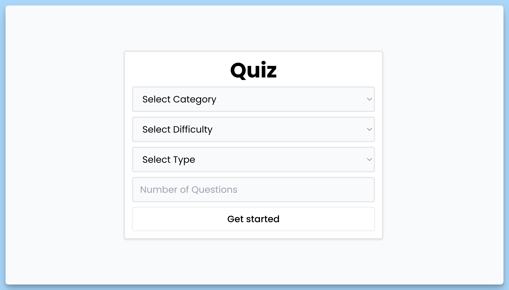

## 📦 Quiz App

### 🚀 Review

The code is a React component of the Quiz application. The main purpose of this component is to install root components for routing and determine the position of pop-up notifications.

### Code details
- using "react-hot-toast" library to display toast notifications.
- Routing is configured using "BrowserRouter" from the "react-router-dom" library.
- Uses the "Suspense" component to display a stub ("Loading..." message) while loading route contents.
- The main content of the application is represented by the "AppRoutes" component, which manages the application routes.
- To set pop-up notifications at the bottom center of the screen, use "Toaster" with the position setting "bottom-center".

### Return value
- React element with the root components of the application.

The general purpose of this code is to create the basic structure of the application, including routing and managing toast notifications.

### Component - `Setup`

The code is a React component that allows the user to configure the quiz settings before starting the game. Below is a brief description of this component:

### Short description
- Component name: Setup.
- Main purpose: Setting up quiz parameters before starting the game.
- Return value: React element of the component.

### Code Details
- The component interacts with the application context, accessing methods and data using the "useAppContext" hook.
- To get the quiz categories, use the "useAxios" hook to make a request to the API and get the data. The result is stored in the "response" variable.
- If an error occurs while loading data, the component displays an error message.
- In case of successful data loading or while waiting for loading, the component provides a form with quiz settings. The user can select the category, difficulty level and type of questions, as well as specify the number of questions.
- The "handleSubmit" handler is triggered when the settings form is submitted. It checks that all required fields are filled in and redirects the user to the questions page ("/questions").
- The "handleChange" handler tracks changes in the value in the "Number of Questions" field and updates it in the application context.
- If an error occurs while loading data, the component displays an error message.
- In case of successful data loading or while waiting for loading, the component provides a form with quiz settings. The user can select the category, difficulty level and type of questions, as well as specify the number of questions.

The general purpose of this code is to allow the user to configure the quiz settings before starting the game, as well as to control the transition between pages in the application.

### Component - `Questions`

The code is a React component designed to display and process questions in a quiz. Below is a brief description of this component:

### Short description
- Component name: Questions.
- Main purpose: Displaying and processing questions in the quiz.
- Return value: React element of the component.

### Code details
- The component interacts with the application context, accessing methods and data using the "useAppContext" hook.
- Using the "useAxios" hook, the component makes a request to the API, passing parameters in the URL depending on the selected settings (category, complexity, type and number of questions).
- When a response is received from the API, questions and answer options are processed. The correct answer is mixed with the wrong ones.
- When you click on an answer option, the "handleClick" handler is called. If the selected answer matches the correct answer, the score counter increases by 1. If there are still questions, moves on to the next question, otherwise redirects the user to the "/score" page.
- If an error occurs while requesting data or loading, the component displays an error message.
- In case of successful data loading or while waiting for loading, the component provides information about the current question and answer options, and also displays the current score.

The general purpose of this code is to provide the user with questions and answer options within the quiz and process his answers taking into account the correctness of the answers.

### Component - `Finish`

The code is a React component designed to display the quiz completion screen and handle events in that context. Below is a brief description of this component:

### Short description
- Component name: Finish.
- Main purpose: Displaying the quiz completion screen and handling the "Play again" event.
- Return value: React element of the component.

### Code details
- The component interacts with the application context, accessing methods and data using the "useAppContext" hook.
- When mounting a component using the "useEffect" hook, a "confetti" effect is generated with an animation of falling confetti on the screen.
- The "handleClick" handler is called when the "Play again" button is clicked. This handler resets the player's score and number of questions, and then redirects the user to the home screen.
- Information about the number of correct answers (score) and the total number of questions is displayed on the completion screen.

The general purpose of this code is to complete the quiz, display the score, animation, and provide the ability to start the quiz again.

---
#### 🌄 Preview:

